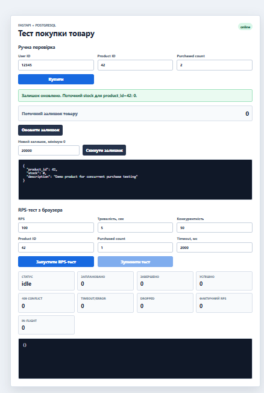
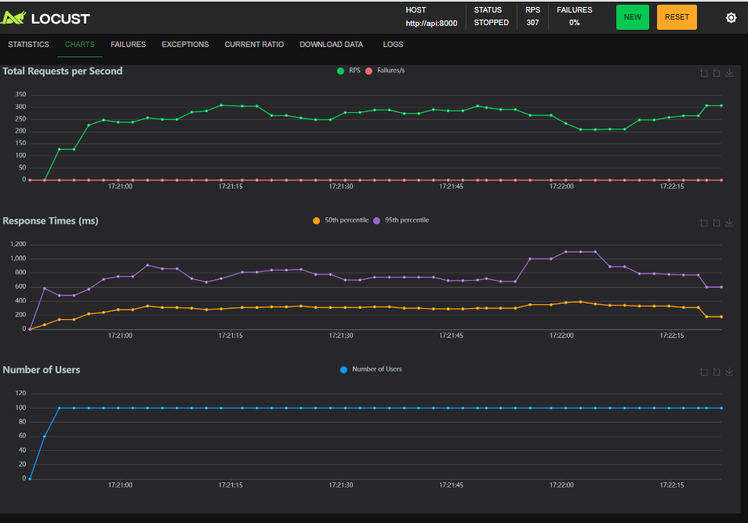
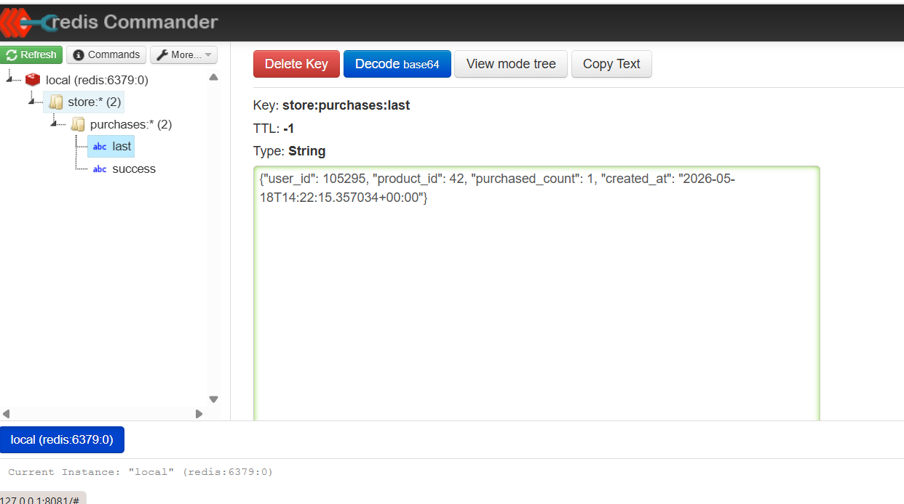
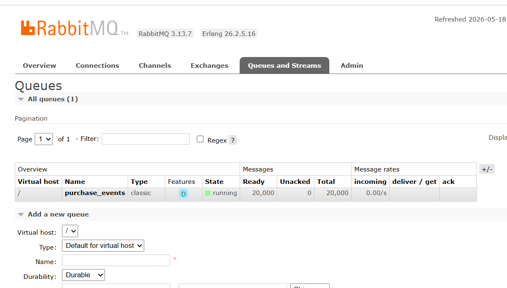

# FastAPI Backend Store: навантажений backend магазину

Цей проєкт показує, як backend магазину обробляє багато одночасних покупок одного товару. У системі є FastAPI API, PostgreSQL, Redis, RabbitMQ, Locust, Redis Commander, RabbitMQ Management UI і невеликий frontend для ручної перевірки.

Головна навчальна ідея: товар не має продаватися “в мінус”, навіть якщо багато користувачів одночасно натискають купити.

## Чого навчає цей проєкт

Проєкт навчає запускати backend-стенд через Docker, працювати з FastAPI endpoint-ами, перевіряти стан PostgreSQL, Redis і RabbitMQ, запускати RPS-тести через Locust і читати результати навантаження.

Викладач дав саме такий тип завдання, бо тут є реальна backend-проблема: одночасний доступ до обмеженого ресурсу. У нашому випадку ресурс — це `stock` товару в базі.

## Архітектура

| Частина | Для чого потрібна |
| --- | --- |
| FastAPI | Приймає HTTP-запити: покупка, перегляд товару, healthcheck |
| PostgreSQL | Зберігає товар і залишок `stock` |
| Redis | Зберігає швидкі навчальні значення: лічильник успішних покупок і останню покупку |
| RabbitMQ | Зберігає події успішних покупок у черзі `purchase_events` |
| Redis Commander | Дає подивитися ключі Redis у браузері |
| RabbitMQ Management UI | Дає подивитися черги RabbitMQ у браузері |
| Locust | Генерує навантаження і показує RPS, latency, failures |
| Frontend | Дає вручну купити товар, скинути залишок і запустити простий браузерний RPS-тест |

## Як працює покупка

Endpoint:

```text
POST /purchase
```

Приклад input:

```json
{
  "user_id": 12345,
  "product_id": 42,
  "purchased_count": 1
}
```

Головний SQL-запит:

```sql
UPDATE products
SET stock = stock - $1
WHERE product_id = $2
  AND stock >= $1
RETURNING product_id
```

Цей запит важливий, бо перевірка залишку і списання виконуються однією атомарною операцією. Якщо товару вистачає, PostgreSQL списує залишок. Якщо товару не вистачає, залишок не змінюється, а API повертає `409 Conflict`.

Після успішної покупки API також:

- збільшує Redis-ключ `store:purchases:success`;
- записує останню покупку в Redis-ключ `store:purchases:last`;
- публікує подію покупки в RabbitMQ queue `purchase_events`.

## Запуск проєкту

Спочатку відкрий Docker Desktop і дочекайся, поки Docker Engine запуститься.

Перейди в папку проєкту:

```powershell
cd D:\VSCode_Python_Projects_26\fastapi_backend_store_6
```

Зібрати образи:

```powershell
docker compose build
```

Запустити всі сервіси у фоні:

```powershell
docker compose up -d
```

Перевірити стан контейнерів:

```powershell
docker compose ps
```

Очікувано мають працювати:

- `api`;
- `postgres`;
- `redis`;
- `redis-commander`;
- `rabbitmq`;
- `locust`.

## Адреси сервісів

| Сервіс | Адреса | Що там робити |
| --- | --- | --- |
| Frontend | http://127.0.0.1:8000/frontend/ | Купити товар, скинути залишок, запустити браузерний RPS-тест |
| Swagger API docs | http://127.0.0.1:8000/docs | Подивитися і протестувати endpoint-и |
| Healthcheck | http://127.0.0.1:8000/health | Перевірити, що API живий |
| Dependencies | http://127.0.0.1:8000/system/dependencies | Перевірити Redis і RabbitMQ |
| Locust | http://127.0.0.1:8089 | Запустити графічний RPS-тест |
| Redis Commander | http://127.0.0.1:8081 | Подивитися ключі Redis |
| RabbitMQ UI | http://127.0.0.1:15672 | Подивитися черги RabbitMQ |

RabbitMQ login:

```text
guest / guest
```

## Перевірка після запуску

Перевірити API:

```powershell
curl http://127.0.0.1:8000/health
```

Очікувано:

```json
{"status":"ok"}
```

Перевірити Redis і RabbitMQ:

```powershell
curl http://127.0.0.1:8000/system/dependencies
```

Приклад відповіді:

```json
{
  "redis": {
    "connected": true,
    "successful_purchases_recorded": 105295,
    "last_purchase": {
      "user_id": 105295,
      "product_id": 42,
      "purchased_count": 1,
      "created_at": "2026-05-18T14:22:15.357034+00:00"
    }
  },
  "rabbitmq": {
    "connected": true,
    "queue": "purchase_events",
    "messages_ready": 20000,
    "consumers": 0
  }
}
```

## Робота з frontend

Відкрий:

```text
http://127.0.0.1:8000/frontend/
```



### Ручна перевірка

Поля:

- `User ID` — id користувача. Для тесту можна залишати будь-яке додатне число.
- `Product ID` — id товару. У цьому проєкті основний тестовий товар має `product_id = 42`.
- `Purchased count` — скільки одиниць товару купити за один запит.

Кнопки:

- `Купити` — виконує `POST /purchase`.
- `Оновити залишок` — виконує `GET /products/42`.
- `Скинути залишок` — виконує `POST /products/42/reset`.

Перед RPS-тестом корисно поставити великий залишок, наприклад:

```text
Новий залишок = 20000
```

Якщо залишок буде малий, тест швидко почне отримувати `409 Conflict`, бо товар закінчиться.

### RPS-тест у frontend

Поля:

- `RPS` — скільки запитів на секунду браузер намагається створити.
- `Тривалість, сек` — скільки секунд триватиме тест.
- `Конкурентність` — скільки запитів можуть одночасно очікувати відповідь.
- `Product ID` — товар для тесту, зазвичай `42`.
- `Purchased count` — скільки одиниць списувати за один запит.
- `Timeout, мс` — скільки чекати відповідь перед тим, як вважати запит помилкою.

Метрики:

- `Статус` — `idle`, `running`, `draining`, `finished`, `stopped`.
- `Заплановано` — скільки запитів браузер спробував створити.
- `Завершено` — скільки запитів уже завершилися.
- `Успішно` — скільки покупок отримали `200 OK`.
- `409 Conflict` — скільки покупок не пройшли через нестачу товару.
- `Timeout/Error` — скільки запитів завершилися timeout або іншою помилкою.
- `Dropped` — скільки запитів браузер не зміг відправити через власні обмеження.
- `Фактичний RPS` — реальна швидкість завершених запитів.
- `In-flight` — скільки запитів зараз очікують відповідь.

Frontend-тест зручний для навчання, але точніший benchmark краще робити через Locust.

## Locust у браузері

Відкрий:

```text
http://127.0.0.1:8089
```

Для тесту можна ввести:

```text
Number of users = 100
Ramp up = 20
Host = http://api:8000
```

Потім натисни `Start swarming`.



### Що означають графіки Locust

`Total Requests per Second`:

- зелена лінія `RPS` показує, скільки запитів на секунду обробляється;
- червона лінія `Failures/s` показує, скільки помилок за секунду;
- якщо червона лінія біля нуля, тест проходить без помилок.

`Response Times (ms)`:

- `50th percentile` — типовий час відповіді для половини запитів;
- `95th percentile` — 95% запитів були не повільніші за це значення;
- якщо 95th percentile різко росте, система починає відповідати повільніше під навантаженням.

`Number of Users`:

- показує, скільки віртуальних користувачів Locust зараз створив;
- на скріншоті видно, що кількість користувачів дійшла до 100 і трималась стабільно.

`Status STOPPED` означає, що тест уже завершено, а графіки показують результат останнього запуску.

## Locust у терміналі

Команда, яку було запущено:

```powershell
docker compose run --rm -T locust -f /mnt/locust/locustfile.py --host http://api:8000 --headless -u 100 -r 20 -t 30s --only-summary
```

Що означають параметри:

| Параметр | Значення |
| --- | --- |
| `--rm` | видалити тимчасовий контейнер Locust після завершення |
| `-T` | не відкривати інтерактивний pseudo-TTY |
| `-f /mnt/locust/locustfile.py` | файл сценарію Locust |
| `--host http://api:8000` | тестувати API всередині docker compose мережі |
| `--headless` | запуск без браузерного UI |
| `-u 100` | 100 віртуальних користувачів |
| `-r 20` | додавати 20 користувачів за секунду |
| `-t 30s` | тест триває 30 секунд |
| `--only-summary` | показати тільки фінальну таблицю |

### Твій результат Locust

```text
Type     Name                          # reqs   # fails   Avg   Min   Max   Med   req/s
GET      /products/{product_id}          1465   0(0.00%)   109     8   410   100    49.18
POST     /purchase                      14734   0(0.00%)   132     7   517   120   494.62
GET      /system/dependencies            1482   0(0.00%)   155    12   815   140    49.75
Aggregated                              17681   0(0.00%)   132     7   815   120   593.55
```

Пояснення:

- `# reqs` — скільки запитів зробив Locust.
- `# fails` — скільки запитів завершилися помилкою.
- `Avg` — середній час відповіді в мілісекундах.
- `Min` — найшвидша відповідь.
- `Max` — найповільніша відповідь.
- `Med` — медіана, типовий час відповіді.
- `req/s` — requests per second.

Найважливіший результат:

```text
Aggregated: 17681 requests, 0 failures, 593.55 req/s
```

Це означає, що за 30 секунд сценарій виконав `17681` HTTP-запит, помилок не було, а загальна швидкість була приблизно `593.55 RPS`.

Для основного endpoint:

```text
POST /purchase: 14734 requests, 0 failures, 494.62 req/s
```

Це означає, що саме покупки проходили зі швидкістю приблизно `495 RPS`, без помилок.

### Percentiles

```text
POST /purchase:
50%  = 120 ms
95%  = 250 ms
99%  = 380 ms
100% = 520 ms
```

Це означає:

- половина покупок відповідала до `120 ms`;
- 95% покупок відповідали до `250 ms`;
- 99% покупок відповідали до `380 ms`;
- найповільніша покупка відповідала приблизно `520 ms`.

### CPU warning

Locust показав:

```text
CPU usage above 90%!
```

Це означає, що машина, яка генерує навантаження, була сильно завантажена. Через це результати можуть бути обмежені не тільки FastAPI/PostgreSQL, а ще й можливостями комп’ютера або Docker Desktop.

Навчальний висновок: якщо CPU генератора навантаження вище 90%, то для дуже точного benchmark треба запускати Locust distributed або на окремій машині. Для навчального проєкту цей результат достатній: `0% failures` і майже `495 RPS` для покупок.

## Redis Commander

Відкрий:

```text
http://127.0.0.1:8081
```



На скріншоті видно ключ:

```text
store:purchases:last
```

Що означають поля:

- `Key: store:purchases:last` — ключ Redis, у якому збережено останню успішну покупку.
- `TTL: -1` — ключ не має автоматичного часу видалення.
- `Type: String` — значення збережено як Redis string.
- JSON у полі значення — дані останньої покупки.

Приклад:

```json
{
  "user_id": 105295,
  "product_id": 42,
  "purchased_count": 1,
  "created_at": "2026-05-18T14:22:15.357034+00:00"
}
```

Що це доводить:

- API після успішної покупки реально записує дані в Redis.
- Redis можна використовувати для швидких лічильників, кешу або короткого стану системи.
- `store:purchases:last` допомагає швидко побачити, яка покупка була останньою.

Другий важливий ключ:

```text
store:purchases:success
```

Це лічильник успішних покупок. Він збільшується після кожного успішного `POST /purchase`.

## RabbitMQ Management UI

Відкрий:

```text
http://127.0.0.1:15672
```

Логін:

```text
guest / guest
```



На скріншоті відкрита вкладка `Queues and Streams`.

Що означають поля:

| Поле | Значення для проєкту |
| --- | --- |
| `Virtual host /` | Стандартний простір RabbitMQ |
| `Name purchase_events` | Черга, куди API записує події успішних покупок |
| `Type classic` | Звичайна класична RabbitMQ queue |
| `Features D` | Durable queue, черга переживає перезапуск RabbitMQ |
| `State running` | Черга активна і працює |
| `Ready 20,000` | 20 000 повідомлень лежать у черзі й готові до читання |
| `Unacked 0` | Немає повідомлень, які consumer взяв, але ще не підтвердив |
| `Total 20,000` | Усього в черзі 20 000 повідомлень |
| `incoming 0.00/s` | Зараз нові повідомлення не надходять |
| `deliver / get 0.00/s` | Зараз ніхто не читає повідомлення |
| `ack 0.00/s` | Зараз ніхто не підтверджує обробку повідомлень |

Висновок по RabbitMQ:

API успішно створює події покупок і складає їх у чергу `purchase_events`. Оскільки в проєкті немає окремого consumer-сервісу, повідомлення накопичуються в `Ready`. Це нормально для навчального стенду: ми бачимо, що producer працює.

У production зазвичай додають consumer, який читає такі події і робить додаткову роботу: надсилає email, пише аналітику, оновлює CRM або формує чек.

## Консольний Python RPS-тест

Окрім Locust, є тест:

```powershell
python tests\load_test.py --base-url http://127.0.0.1:8000 --rps 500 --duration 15 --concurrency 50 --timeout 5
```

Перед тестом бажано скинути залишок:

```powershell
$body = @{ stock = 20000 } | ConvertTo-Json
Invoke-RestMethod -Uri "http://127.0.0.1:8000/products/42/reset" -Method Post -ContentType "application/json" -Body $body
```

Цей тест корисний, коли треба швидко перевірити API без Locust UI.

## Корисні команди керування проєктом

### Запуск

```powershell
docker compose build
docker compose up -d
docker compose ps
```

### Перезапуск після змін у коді

```powershell
docker compose up --build -d
```

### Подивитися логи

Усі сервіси:

```powershell
docker compose logs --tail=80
```

Тільки API:

```powershell
docker compose logs --tail=80 api
```

API, Redis і RabbitMQ:

```powershell
docker compose logs --tail=80 api redis rabbitmq
```

### Зупинити проєкт без видалення даних

```powershell
docker compose down
```

Це зупиняє контейнери, але volume з PostgreSQL, Redis і RabbitMQ залишаються.

### Повністю зупинити і очистити дані

```powershell
docker compose down -v
```

Це видаляє volumes:

- `postgres_data`;
- `redis_data`;
- `rabbitmq_data`.

Після цього при наступному запуску база PostgreSQL створиться заново з `db/init.sql`.

### Зупинити тільки один сервіс

```powershell
docker compose stop locust
docker compose stop redis-commander
docker compose stop rabbitmq
```

### Запустити тільки один сервіс назад

```powershell
docker compose up -d locust
docker compose up -d redis-commander
docker compose up -d rabbitmq
```

### Перезапустити API

```powershell
docker compose restart api
```

### Перевірити health API

```powershell
curl http://127.0.0.1:8000/health
```

### Перевірити залежності API

```powershell
curl http://127.0.0.1:8000/system/dependencies
```

### Подивитися товар

```powershell
curl http://127.0.0.1:8000/products/42
```

### Скинути залишок товару

```powershell
$body = @{ stock = 20000 } | ConvertTo-Json
Invoke-RestMethod -Uri "http://127.0.0.1:8000/products/42/reset" -Method Post -ContentType "application/json" -Body $body
```

### Зайти в PostgreSQL

```powershell
docker compose exec postgres psql -U store_user -d store_db
```

Подивитися товари:

```sql
SELECT * FROM products ORDER BY product_id;
```

### Перевірити Redis через CLI

```powershell
docker compose exec redis redis-cli ping
docker compose exec redis redis-cli keys "store:*"
docker compose exec redis redis-cli get store:purchases:success
docker compose exec redis redis-cli get store:purchases:last
```

Очистити Redis:

```powershell
docker compose exec redis redis-cli FLUSHDB
```

### Перевірити RabbitMQ container

```powershell
docker compose exec rabbitmq rabbitmq-diagnostics ping
docker compose exec rabbitmq rabbitmqctl list_queues name messages_ready messages_unacknowledged consumers
```

Очистити чергу `purchase_events`:

```powershell
docker compose exec rabbitmq rabbitmqctl purge_queue purchase_events
```

### Запустити Locust headless

```powershell
docker compose run --rm -T locust -f /mnt/locust/locustfile.py --host http://api:8000 --headless -u 100 -r 20 -t 30s --only-summary
```

### Зупинити завислий тест

У терміналі натисни:

```text
Ctrl + C
```

Якщо після цього залишився тимчасовий контейнер:

```powershell
docker compose ps -a
docker compose down
```

## Коли щось не працює

1. Перевір, що Docker Desktop запущений.
2. Перевір контейнери:

```powershell
docker compose ps
```

3. Перевір API:

```powershell
curl http://127.0.0.1:8000/health
```

4. Перевір Redis і RabbitMQ:

```powershell
curl http://127.0.0.1:8000/system/dependencies
```

5. Подивись логи:

```powershell
docker compose logs --tail=80 api redis rabbitmq
```

6. Якщо треба повністю почати заново:

```powershell
docker compose down -v
docker compose up --build -d
```

## Навчальний висновок

Цей проєкт показав повний шлях backend-розробника: написати API, підключити базу, запустити все через Docker, додати Redis і RabbitMQ, перевірити систему через frontend і Locust, а потім правильно прочитати результати.

Головні висновки:

- PostgreSQL відповідає за коректний залишок товару.
- FastAPI приймає покупки і повертає зрозумілі HTTP-відповіді.
- Redis швидко показує лічильники і останню покупку.
- RabbitMQ накопичує події покупок для майбутньої обробки.
- Locust показує, скільки RPS витримує система і як росте latency.
- `0% failures` у твоєму Locust-тесті означає, що API стабільно відповідав під заданим навантаженням.
- Попередження CPU вище 90% означає, що навантаження вже впирається у ресурси комп’ютера.
- Найважливіше: після навантаження `stock` не має ставати від’ємним.

Завдяки цьому проєкту я навчилась не тільки запускати backend, а й аналізувати його поведінку під навантаженням: дивитися RPS, latency, failures, черги RabbitMQ, ключі Redis і робити технічний висновок по роботі системи.
