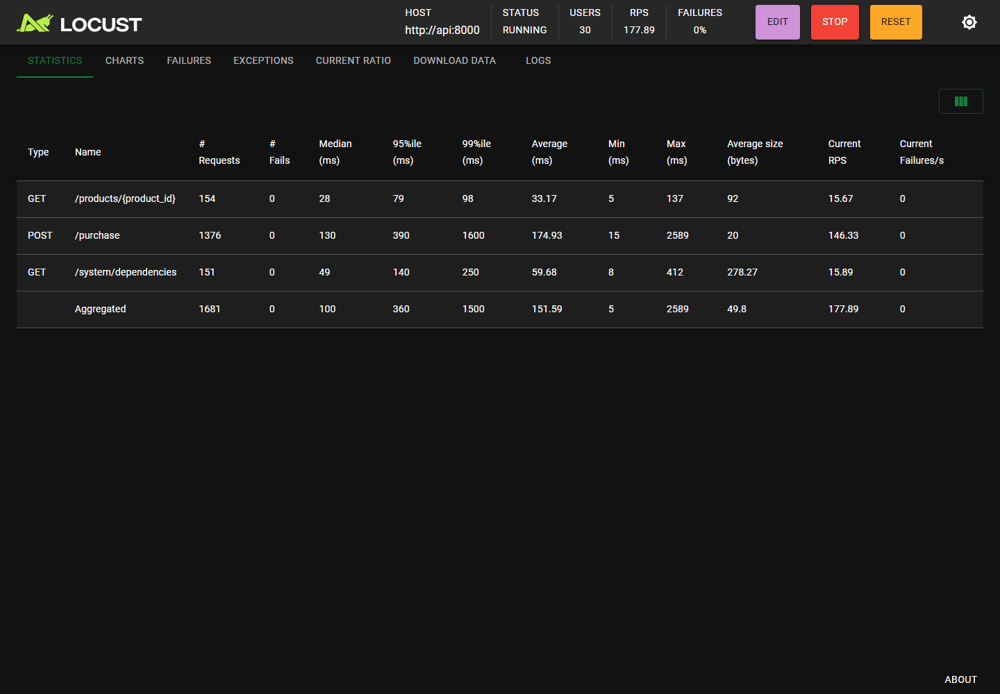
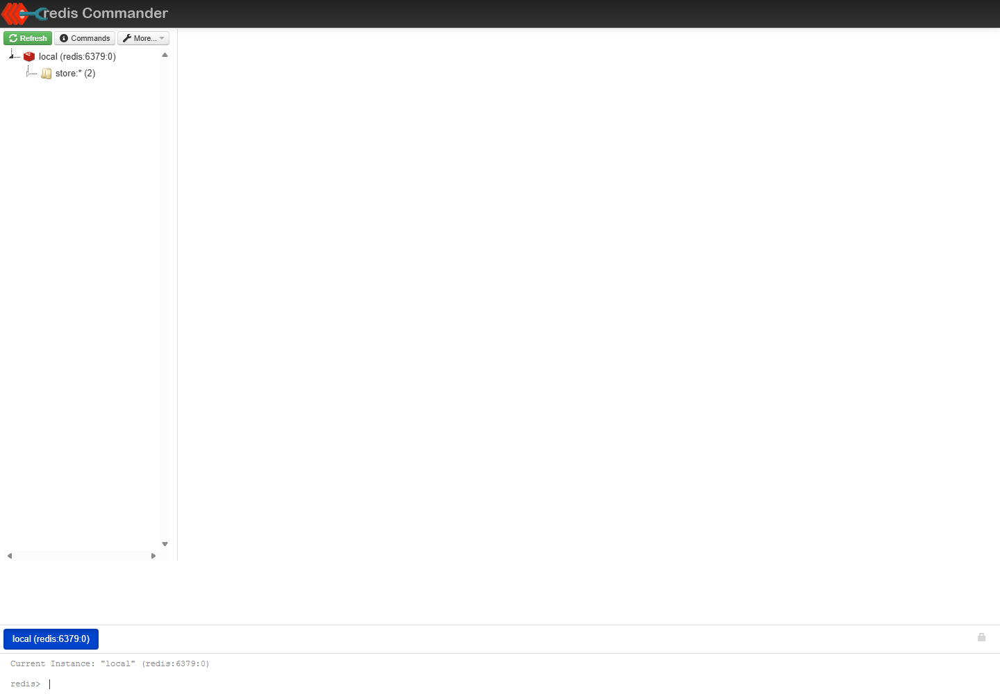
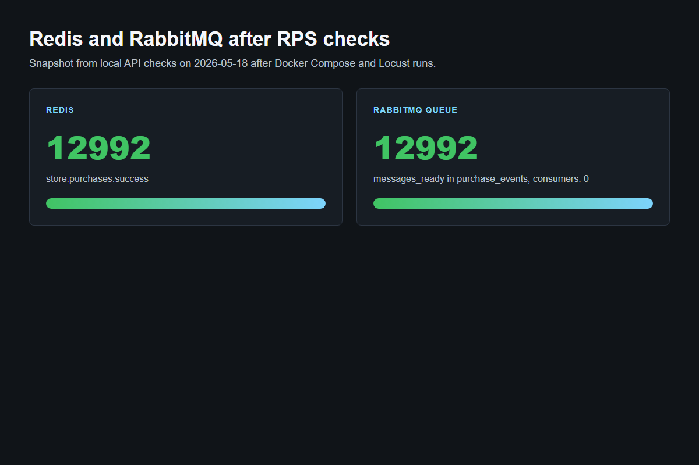

# FastAPI Backend Store: висновок і перевірка RPS

Цей проєкт показує, як backend магазину поводиться під навантаженням. У ньому є товар зі складським залишком, endpoint `POST /purchase` для покупки та перевірка, що товар не продається “в мінус”, навіть коли багато користувачів купують одночасно.

Головний висновок: правильний SQL-запит у PostgreSQL може безпечно обробляти одночасні покупки, а RPS треба перевіряти не “на око”, а через навантажувальний тест і графіки.

## Що додано

- `PostgreSQL` з таблицею товарів.
- `Redis` для швидкого збереження навчальних лічильників успішних покупок.
- `Redis Commander` для перегляду ключів Redis у браузері.
- `RabbitMQ` для запису подій про успішні покупки в чергу.
- `RabbitMQ Management UI` для перегляду черг і повідомлень.
- `Locust` для наочного тестування RPS у браузері.
- Endpoint `GET /system/dependencies`, який показує стан Redis і RabbitMQ.
- Файл `tests/locustfile.py` для запуску графічного RPS-тесту.
- Старий консольний тест `tests/load_test.py` залишено для швидкої перевірки без графічного інтерфейсу.

## Як запустити

Потрібен Docker Desktop.

```bash
docker compose build
docker compose up -d
docker compose ps
```

Після запуску відкрий:

| Сервіс | Адреса | Для чого |
| --- | --- | --- |
| FastAPI frontend | http://127.0.0.1:8000/frontend/ | ручна покупка і простий браузерний RPS-тест |
| API документація | http://127.0.0.1:8000/docs | перевірка endpoint-ів |
| Locust | http://127.0.0.1:8089 | графіки RPS, latency, помилки |
| Redis Commander | http://127.0.0.1:8081 | перегляд ключів Redis |
| RabbitMQ UI | http://127.0.0.1:15672 | перегляд черги `purchase_events` |

Логін і пароль RabbitMQ за замовчуванням:

```text
guest / guest
```

## Як перевірити, що все працює

Спочатку відкрий:

```text
http://127.0.0.1:8000/system/dependencies
```

Очікуваний зміст відповіді:

```json
{
  "redis": {
    "connected": true
  },
  "rabbitmq": {
    "connected": true,
    "queue": "purchase_events"
  }
}
```

Після успішних покупок у Redis зʼявляється ключ `store:purchases:success`, а в RabbitMQ накопичуються повідомлення в черзі `purchase_events`.

Під час локальної перевірки 2026-05-18 усі сервіси піднялись через Docker Compose:

```text
api               Up
postgres          Up (healthy)
redis             Up (healthy)
rabbitmq          Up (healthy)
redis-commander   Up (healthy)
locust            Up
```

Перевірка API після запуску:

```json
{
  "status": "ok"
}
```

Перевірка Redis і RabbitMQ:

```json
{
  "redis": {
    "connected": true
  },
  "rabbitmq": {
    "connected": true,
    "queue": "purchase_events"
  }
}
```

## Як подивитися RPS наочно через Locust

1. Відкрий http://127.0.0.1:8089.
2. У полі `Number of users` постав, наприклад, `100`.
3. У полі `Ramp up` постав `20`.
4. Host має бути `http://api:8000`. Якщо поле порожнє, введи це значення.
5. Натисни `Start swarming`.
6. Вкладка `Charts` покаже RPS, час відповіді та кількість помилок.

Перед новим тестом зручно скинути залишок товару через frontend:

```text
http://127.0.0.1:8000/frontend/
```

Для тестового товару використовуй:

```text
product_id = 42
stock = 10000 або більше
```

## Консольний RPS-тест

Якщо потрібен не графік, а коротка таблиця в терміналі:

```bash
pip install -r tests/requirements.txt
python tests/load_test.py --base-url http://127.0.0.1:8000 --rps 500 --duration 15 --concurrency 50
```

У кінці скрипт покаже:

- цільовий RPS;
- фактичний RPS;
- кількість успішних покупок;
- кількість `409 Conflict`;
- середню затримку;
- `P95 latency`.

## Перевірений Locust RPS-тест

Контрольний тест був запущений після `docker compose build` і `docker compose up -d`.

Перед тестом:

```text
product_id = 42
stock = 50000
Redis очищено через FLUSHDB
RabbitMQ queue purchase_events очищено
```

Команда тесту:

```bash
docker compose run --rm -T locust -f /mnt/locust/locustfile.py --host http://api:8000 --headless -u 100 -r 20 -t 30s --only-summary
```

Параметри:

| Параметр | Значення |
| --- | --- |
| Користувачі Locust | 100 |
| Ramp up | 20 users/s |
| Тривалість | 30 секунд |
| Host | `http://api:8000` |
| Основний endpoint | `POST /purchase` |

Результат Locust:

| Endpoint | Requests | Failures | Avg latency | P95 latency | RPS |
| --- | ---: | ---: | ---: | ---: | ---: |
| `POST /purchase` | 6248 | 0 | 387 ms | 750 ms | 209.09 |
| `GET /products/{product_id}` | 662 | 0 | 217 ms | 440 ms | 22.15 |
| `GET /system/dependencies` | 660 | 0 | 107 ms | 260 ms | 22.09 |
| Aggregated | 7570 | 0 | 348 ms | 720 ms | 253.33 |

Після завершення тесту система показала:

| Перевірка | Значення |
| --- | ---: |
| Залишок товару після тесту | 43717 |
| Redis `store:purchases:success` | 6283 |
| RabbitMQ `purchase_events.messages_ready` | 6283 |
| RabbitMQ consumers | 0 |

Чому Locust показав `6248` покупок, а Redis/RabbitMQ `6283`: Locust друкує summary у момент завершення runner-а, а частина відповідей ще встигає дописатися в систему під час shutdown/drain. Для навчального висновку важливо, що помилок було `0%`, а PostgreSQL не допустив відʼємний stock.

## Скриншоти перевірки

Locust під час короткого UI-тесту:



Redis Commander після тестів показує ключі `store:*`:



RabbitMQ UI відкривається на http://127.0.0.1:15672 з логіном `guest / guest`. У headless-режимі браузер зупинився на login-формі, тому нижче додано знімок за фактичними даними з RabbitMQ Management API та Redis:



Після додаткового короткого Locust UI-тесту для скриншота фінальний стан був таким:

```json
{
  "redis": {
    "connected": true,
    "successful_purchases_recorded": 12992
  },
  "rabbitmq": {
    "connected": true,
    "queue": "purchase_events",
    "messages_ready": 12992,
    "consumers": 0
  }
}
```

## Що означають результати

`RPS` означає requests per second, тобто скільки HTTP-запитів API обробляє за одну секунду.

`200 OK` означає, що покупка пройшла успішно.

`409 Conflict` у цьому проєкті не завжди є помилкою. Це очікувана відповідь, коли товар на складі закінчився. Важливо, що stock не стає відʼємним.

`P95 latency` означає, що 95% запитів були не повільніші за це значення. Наприклад, `P95 = 80 ms` означає, що майже всі запити відповідали до 80 мс.

## Результати перевірки в цьому середовищі

У поточному середовищі кодова перевірка пройдена:

```text
syntax ok
```

Docker Compose build, запуск контейнерів, API healthcheck, Redis, RabbitMQ і Locust RPS-тест виконані успішно 2026-05-18. Отриманий контрольний результат: приблизно `209 RPS` для `POST /purchase` і приблизно `253 RPS` агреговано по всіх endpoint-ах сценарію Locust.

## Таблиця для запису власного результату

Після запуску Locust або `tests/load_test.py` заповни цю таблицю фактичними числами:

| Параметр | Значення |
| --- | --- |
| Дата тесту | |
| Машина / ноутбук | |
| Користувачі Locust або concurrency | |
| Тривалість тесту | |
| Цільовий RPS | |
| Фактичний RPS | |
| Успішні покупки | |
| `409 Conflict` | |
| Помилки / timeout | |
| Average latency | |
| P95 latency | |
| Кінцевий stock | |

## Навчальний висновок

Проєкт демонструє повний маленький backend-стенд: API приймає покупки, PostgreSQL гарантує коректний залишок товару, Redis показує швидкі лічильники, RabbitMQ зберігає події, а Locust дозволяє побачити RPS на графіках.

Для учня головне зрозуміти не тільки “як запустити”, а й “що саме ми вимірюємо”. Якщо RPS росте, але latency і помилки теж різко ростуть, система вже перевантажена. Якщо є багато `409 Conflict`, це може бути нормальним результатом, коли товар закінчився. Найважливіше, що після будь-якого навантаження складський залишок не має стати меншим за нуль.
