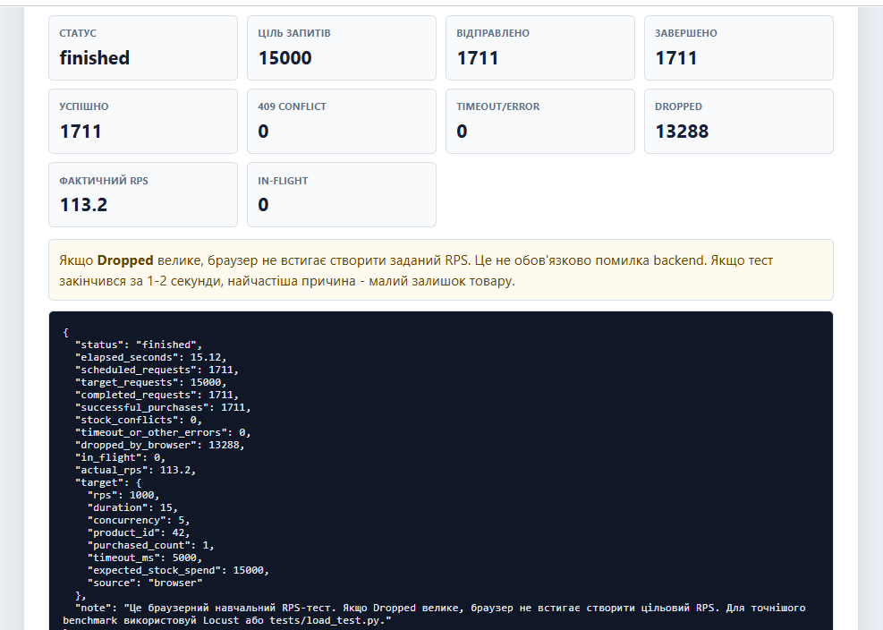
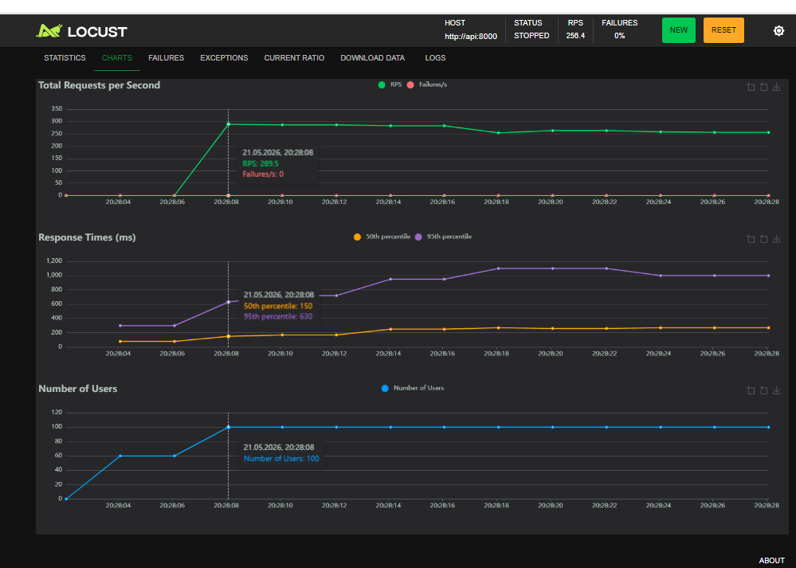
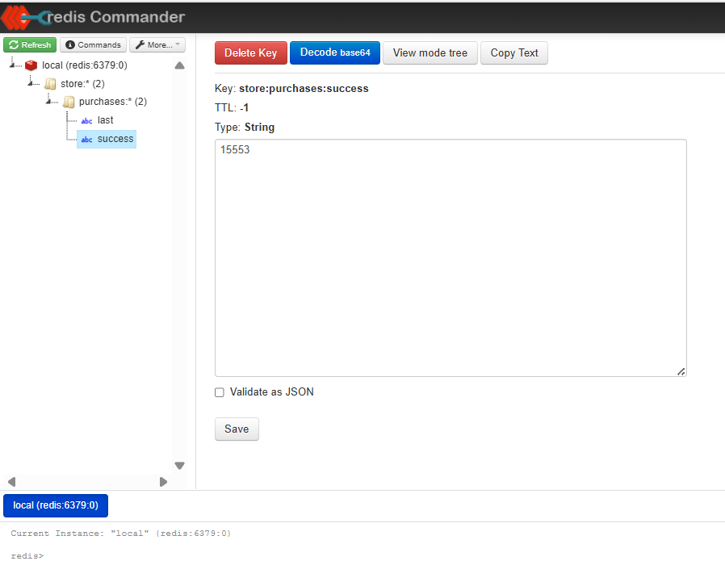
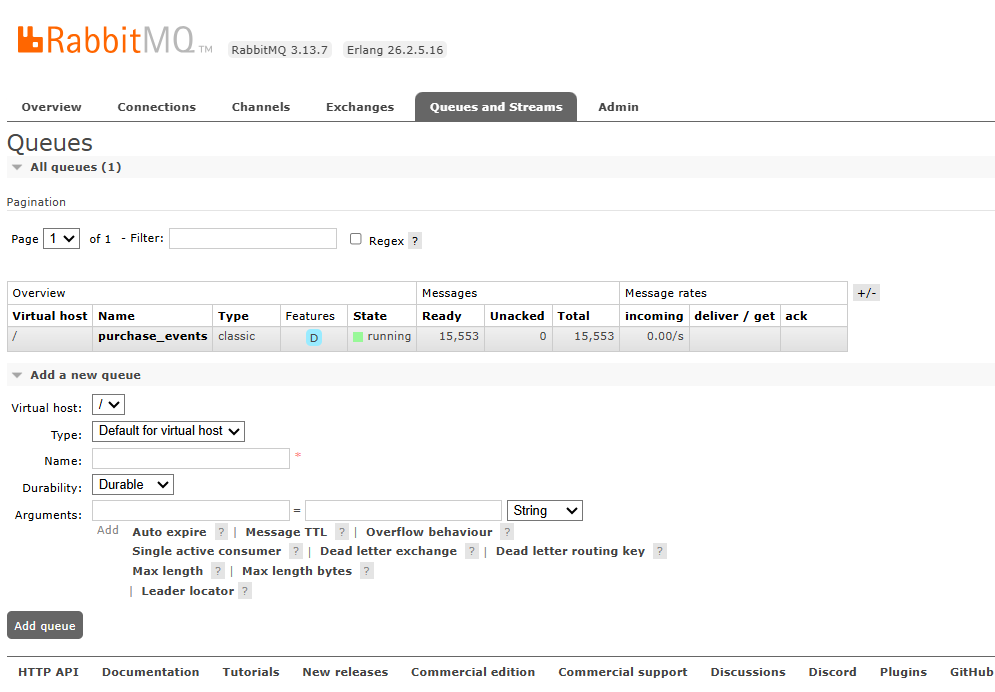

# FastAPI Backend Store: Prod 2

## Українська версія

Цей проєкт показує backend магазину під навантаженням: багато користувачів одночасно купують один товар, а система не дозволяє списати `stock` у мінус. У гілці `prod2` проєкт став ближчим до production-стенду: зʼявились Nginx, Redis, RabbitMQ, Locust, Redis Commander, RabbitMQ Management UI, frontend-панель і структурована FastAPI-архітектура.

Головна ідея: PostgreSQL відповідає за коректне атомарне списання товару, FastAPI приймає HTTP-запити, Redis і RabbitMQ показують інтеграції після успішної покупки, а Locust/frontend допомагають побачити поведінку системи під навантаженням.

## Архітектура Prod 2

| Компонент | Роль |
| --- | --- |
| FastAPI | API для покупки, перегляду товарів, healthcheck і системних статусів |
| PostgreSQL | Основне джерело правди для `products.stock` |
| Redis | Лічильник успішних покупок і остання покупка |
| RabbitMQ | Черга `purchase_events` з подіями успішних покупок |
| Nginx | Reverse proxy перед API на зовнішньому порті `8000` |
| Locust | Професійніший генератор навантаження, ніж браузер |
| Frontend | Навчальна панель для ручної покупки і простого RPS-тесту |
| Redis Commander | Перегляд ключів Redis у браузері |
| RabbitMQ Management UI | Перегляд черг RabbitMQ |

Схема запиту:

```text
Browser / Locust / curl
        |
        v
Nginx :8000
        |
        v
FastAPI api:8000
        |
        +--> PostgreSQL: atomic UPDATE stock
        +--> Redis: counters and last purchase
        +--> RabbitMQ: purchase_events
```

## Порівняння prod_1 і prod2

У `prod_1` основна логіка була зібрана в одному файлі `app/main.py`: схеми, endpoint-и, SQL, middleware, startup/shutdown і бізнес-логіка покупки. Це нормально для першої версії, але складно підтримувати, коли додаються інтеграції та навантажувальні тести.

У `prod2` код розділено за відповідальністю:

| Було у prod_1 | Стало у prod2 | Навіщо |
| --- | --- | --- |
| Один великий `app/main.py` | `api/routes`, `services`, `repositories`, `schemas`, `core`, `middleware` | Код легше читати, тестувати і розширювати |
| Прямий доступ до API | Nginx reverse proxy | Ближче до production-схеми запуску |
| Менше runtime-спостереження | `/system/dependencies`, Redis Commander, RabbitMQ UI | Видно стан Redis, RabbitMQ і черги |
| Простіша перевірка навантаження | Locust + browser RPS + `tests/load_test.py` | Можна порівнювати браузерний тест і реальний load-test |
| Публікація події чекала в `/purchase` | Подія винесена у FastAPI background task | HTTP-відповідь не чекає Redis/RabbitMQ після списання stock |
| Менше документації | README з поясненнями, скриншотами і командами | Проєкт легше захищати і пояснювати |

Головна бізнес-логіка залишилась правильною: покупка виконує атомарний SQL-запит.

```sql
UPDATE products
SET stock = stock - $1
WHERE product_id = $2
  AND stock >= $1
RETURNING product_id;
```

Це важливо, бо перевірка залишку і списання відбуваються в одній операції PostgreSQL. Якщо товару не вистачає, API повертає `409 Conflict`, а `stock` не змінюється.

## Чому FPS/RPS у Prod 2 може бути нижчим

У скриншоті frontend видно, що тест намагався створити `15000` запитів, але реально завершив `1711`, а `13288` були `Dropped`.



Це не означає, що backend обовʼязково зламався. Тут важливо розділяти два показники:

- `RPS` — requests per second, тобто скільки HTTP-запитів реально створюється і завершується.
- `FPS` у контексті браузера — наскільки швидко сторінка встигає оновлювати інтерфейс і графічний стан.

Причини, чому в `prod2` браузерний FPS/RPS може виглядати нижчим:

1. Браузер не є точним генератором навантаження. JavaScript, DOM, `fetch`, таймери і рендеринг працюють в одному клієнтському середовищі.
2. Frontend раніше оновлював багато метрик і великий JSON майже на кожну відповідь. При високому RPS сама панель починала сповільнювати генерацію запитів.
3. У `prod2` після успішної покупки є додаткова інтеграційна робота: Redis-лічильник, запис останньої покупки і RabbitMQ-подія.
4. Nginx додає один proxy-hop. Це невелика, але реальна накладна вартість за production-like архітектуру.
5. Docker Desktop запускає одразу більше сервісів: API, PostgreSQL, Redis, RabbitMQ, Nginx, Locust, Redis Commander. Вони ділять CPU, RAM і мережеві ресурси.
6. Якщо `stock` менший за цільову кількість покупок, тест швидко отримує `409 Conflict` або зупиняється раніше. Це коректна поведінка, а не помилка backend.

Висновок: уповільнення зʼявилося не через одну причину. Частина просадки повʼязана з новими production-like фічами, але найбільша проблема саме для браузерного тесту була в тому, що frontend занадто часто перемальовував метрики під час навантаження. Для точного benchmark краще використовувати Locust або `tests/load_test.py`.

## Що я оптимізувала у цій правці

| Файл | Що змінено | Причина | Наслідок |
| --- | --- | --- | --- |
| `frontend/script.js` | Додано throttling оновлення метрик до приблизно 4 разів на секунду | DOM і JSON-render не мають виконуватись на кожен запит | Браузер менше витрачає CPU на інтерфейс і краще генерує RPS |
| `app/integrations.py` | Redis pipeline працює з `transaction=False` | Для незалежних `INCR` і `SET` не потрібен `MULTI/EXEC` | Менше накладних витрат на Redis-запис |
| `app/integrations.py` | JSON серіалізується компактно через `separators=(",", ":")` | У Redis/RabbitMQ не потрібні пробіли в payload | Менше байтів у Redis і RabbitMQ |
| `app/integrations.py` | RabbitMQ channel створюється з `publisher_confirms=False` | Навчальна подія не повинна гальмувати throughput очікуванням confirm на кожну публікацію | Менше latency/overhead для фонового producer; компроміс: немає per-message publisher confirm |
| `nginx/default.conf` | Додано upstream `keepalive 32` і `proxy_set_header Connection ""` | Nginx може перевикористовувати зʼєднання до FastAPI | Менше TCP-overhead між Nginx і API |
| `nginx/default.conf` | Вимкнено `access_log` і додано proxy timeouts | Під час load-test access log створює зайвий I/O | Менше шуму і стабільніша поведінка під навантаженням |
| `app/config.py` | Значення за замовчуванням узгоджено з `.env`: `API_WORKERS=3`, `DB_POOL_MAX_SIZE=20` | 5 worker-ів по 50 DB connections можуть створити до 250 підключень до PostgreSQL | Більш контрольоване локальне навантаження і менший ризик впертися в ліміт Postgres |
| `app/config.py` | Додано `extra="ignore"` для Pydantic Settings | `.env` містить також Docker-змінні `POSTGRES_USER`, `POSTGRES_PASSWORD`, `POSTGRES_DB` | FastAPI не падає при читанні `.env` через зайві службові змінні |
| `docs/screenshots/*prod2.png` | Додано нові скриншоти з frontend, Locust, Redis Commander і RabbitMQ UI | README має пояснювати саме поточні результати Prod 2 | Документація стала наочною |

## Скриншоти і пояснення

### Frontend RPS


На цьому скриншоті видно browser-based тест. Ціль була `1000 RPS` протягом `15` секунд, тобто `15000` запитів. Фактично завершилось `1711`, а `Dropped` дорівнює `13288`.

`Dropped` означає, що браузер не встиг створити всі запити. Це очікувано для дуже високого RPS у браузері. Після оптимізації frontend менше витрачає CPU на перемальовування метрик, але браузерний тест все одно залишається навчальним, не еталонним benchmark.

### Locust Charts



Locust показує стабільніший результат, бо він створений саме для навантажувальних тестів. На графіку видно приблизно `256-289 RPS`, `0% failures`, 100 користувачів і latency-графіки.

Цей скриншот важливий: якщо frontend показує багато `Dropped`, а Locust при цьому тримає стабільний RPS без failures, проблема не обовʼязково в API. Часто обмеження на стороні генератора навантаження.

### Redis Commander



Redis Commander показує ключ `store:purchases:success`. Значення `15553` означає, що API записав кількість успішних покупок у Redis.

Це доводить, що інтеграція з Redis працює: після успішного `POST /purchase` backend не тільки списує товар у PostgreSQL, а й оновлює швидкий лічильник.

### RabbitMQ Management UI



RabbitMQ показує queue `purchase_events`. У черзі `15553` повідомлення `Ready`, `Unacked = 0`, consumer-ів немає.

Це нормально для навчального стенду: API працює як producer і складає події покупок у чергу. Окремий consumer у цьому проєкті ще не доданий, тому повідомлення накопичуються. У production наступним кроком був би worker, який читає ці події і виконує додаткову роботу: email, чек, CRM, аналітика.

## Як запустити

```powershell
cd D:\VSCode_Python_Projects_26\fastapi_backend_store_6
docker compose build
docker compose up -d
docker compose ps
```

Основні адреси:

| Сервіс | URL |
| --- | --- |
| Frontend | http://127.0.0.1:8000/frontend/ |
| Swagger | http://127.0.0.1:8000/docs |
| Healthcheck | http://127.0.0.1:8000/health |
| Dependencies | http://127.0.0.1:8000/system/dependencies |
| Locust | http://127.0.0.1:8089 |
| Redis Commander | http://127.0.0.1:8081 |
| RabbitMQ UI | http://127.0.0.1:15672 |

RabbitMQ login:

```text
guest / guest
```

## Перевірка API

```powershell
curl http://127.0.0.1:8000/health
curl http://127.0.0.1:8000/products/42
curl http://127.0.0.1:8000/system/dependencies
```

Скинути залишок перед тестом:

```powershell
$body = @{ stock = 20000 } | ConvertTo-Json
Invoke-RestMethod -Uri "http://127.0.0.1:8000/products/42/reset" -Method Post -ContentType "application/json" -Body $body
```

Запустити консольний load-test:

```powershell
python tests\load_test.py --base-url http://127.0.0.1:8000 --rps 500 --duration 15 --concurrency 50 --timeout 5
```

Запустити Locust headless:

```powershell
docker compose run --rm -T locust -f /mnt/locust/locustfile.py --host http://api:8000 --headless -u 100 -r 20 -t 30s --only-summary
```

## Практичний висновок

`prod2` став важчим за `prod_1`, бо він робить більше корисної роботи: proxy через Nginx, runtime-інтеграції, Redis, RabbitMQ, dashboard-и і load-test tooling. Тому невелике зниження максимальної швидкості є очікуваною платою за observability і production-like інфраструктуру.

Після оптимізації найсильніша зайва проблема браузерного тесту прибрана: frontend більше не перемальовує метрики на кожен запит. Backend також став легшим на інтеграційному шляху: Redis pipeline простіший, RabbitMQ producer не чекає confirm на кожну навчальну подію, Nginx перевикористовує upstream-зʼєднання.

Для захисту або демонстрації найкраще казати так: frontend-тест показує навчальну поведінку і може впиратися в браузер, а Locust дає більш чесну картину backend throughput.

---

## English Version

This project demonstrates a store backend under load: many users buy the same product at the same time, while the system prevents `stock` from going below zero. In the `prod2` branch, the project became closer to a production-like setup: it now includes Nginx, Redis, RabbitMQ, Locust, Redis Commander, RabbitMQ Management UI, a frontend panel, and a structured FastAPI architecture.

The main idea is simple: PostgreSQL is responsible for the atomic stock update, FastAPI handles HTTP requests, Redis and RabbitMQ demonstrate post-purchase integrations, and Locust/frontend help observe behavior under load.

## Prod 2 Architecture

| Component | Purpose |
| --- | --- |
| FastAPI | Purchase API, product API, healthcheck, system status |
| PostgreSQL | Source of truth for `products.stock` |
| Redis | Successful purchase counter and last purchase |
| RabbitMQ | `purchase_events` queue with successful purchase events |
| Nginx | Reverse proxy in front of the API on external port `8000` |
| Locust | More accurate load generator than the browser |
| Frontend | Training panel for manual purchases and simple browser RPS tests |
| Redis Commander | Browser UI for Redis keys |
| RabbitMQ Management UI | Browser UI for RabbitMQ queues |

Request path:

```text
Browser / Locust / curl
        |
        v
Nginx :8000
        |
        v
FastAPI api:8000
        |
        +--> PostgreSQL: atomic UPDATE stock
        +--> Redis: counters and last purchase
        +--> RabbitMQ: purchase_events
```

## prod_1 vs prod2

In `prod_1`, most logic lived in one large `app/main.py`: schemas, endpoints, SQL, middleware, startup/shutdown, and purchase business logic. That is acceptable for an early version, but it becomes harder to maintain once integrations and load-testing tools are added.

In `prod2`, responsibilities are separated:

| In prod_1 | In prod2 | Why |
| --- | --- | --- |
| One large `app/main.py` | `api/routes`, `services`, `repositories`, `schemas`, `core`, `middleware` | Easier to read, test, and extend |
| Direct API access | Nginx reverse proxy | Closer to production deployment |
| Less runtime visibility | `/system/dependencies`, Redis Commander, RabbitMQ UI | Redis, RabbitMQ, and queues are visible |
| Simpler load checks | Locust + browser RPS + `tests/load_test.py` | Browser and real load-test results can be compared |
| Purchase event awaited inside `/purchase` | Event moved to a FastAPI background task | HTTP response does not wait for Redis/RabbitMQ after stock update |
| Less documentation | README with explanations, screenshots, and commands | Easier to present and defend the project |

The core business logic remains correct: the purchase uses one atomic SQL update.

```sql
UPDATE products
SET stock = stock - $1
WHERE product_id = $2
  AND stock >= $1
RETURNING product_id;
```

The stock check and stock decrement happen in a single PostgreSQL operation. If there is not enough stock, the API returns `409 Conflict` and the stock is not changed.

## Why FPS/RPS Can Be Lower in Prod 2

The frontend screenshot shows that the test targeted `15000` requests, completed `1711`, and dropped `13288`.


This does not automatically mean the backend is broken. Two different ideas matter here:

- `RPS` means requests per second: how many HTTP requests are actually created and completed.
- Browser `FPS` means how fast the page can update its visual state.

Why browser FPS/RPS can look lower in `prod2`:

1. A browser is not an exact load generator. JavaScript, DOM rendering, `fetch`, timers, and UI updates compete in the same client environment.
2. The frontend previously updated many metrics and a large JSON output almost on every response. At high RPS, the dashboard itself slowed down request generation.
3. `prod2` does additional integration work after successful purchases: Redis counter, last purchase record, and RabbitMQ event.
4. Nginx adds one proxy hop. The overhead is small, but real.
5. Docker Desktop now runs more services at the same time: API, PostgreSQL, Redis, RabbitMQ, Nginx, Locust, and Redis Commander.
6. If `stock` is lower than the target number of purchases, the test quickly gets `409 Conflict` or stops earlier. That is correct backend behavior.

Conclusion: the slowdown is not caused by one single thing. Some overhead comes from new production-like features, but the biggest browser-test issue was excessive UI rendering during the load test. For accurate benchmarking, use Locust or `tests/load_test.py`.

## What I Optimized in This Update

| File | Change | Reason | Effect |
| --- | --- | --- | --- |
| `frontend/script.js` | Added metric update throttling to about 4 times per second | DOM and JSON rendering should not run on every request | The browser spends less CPU on UI and can generate RPS more reliably |
| `app/integrations.py` | Redis pipeline uses `transaction=False` | Independent `INCR` and `SET` do not need `MULTI/EXEC` | Lower Redis overhead |
| `app/integrations.py` | JSON uses compact separators | Redis/RabbitMQ payloads do not need spaces | Fewer bytes written to Redis and RabbitMQ |
| `app/integrations.py` | RabbitMQ channel uses `publisher_confirms=False` | Training events should not wait for per-message confirms | Lower background producer overhead; tradeoff: no per-message publisher confirm |
| `nginx/default.conf` | Added upstream `keepalive 32` and cleared `Connection` header | Nginx can reuse connections to FastAPI | Less TCP overhead between Nginx and API |
| `nginx/default.conf` | Disabled `access_log` and added proxy timeouts | Access logs create extra I/O during load tests | Less noise and more stable behavior under load |
| `app/config.py` | Defaults now match `.env`: `API_WORKERS=3`, `DB_POOL_MAX_SIZE=20` | 5 workers with 50 DB connections each could create up to 250 PostgreSQL connections | More controlled local load and lower risk of hitting PostgreSQL limits |
| `app/config.py` | Added `extra="ignore"` for Pydantic Settings | `.env` also contains Docker variables: `POSTGRES_USER`, `POSTGRES_PASSWORD`, `POSTGRES_DB` | FastAPI no longer fails when reading extra service variables from `.env` |
| `docs/screenshots/*prod2.png` | Added new screenshots for frontend, Locust, Redis Commander, and RabbitMQ UI | README should explain the current Prod 2 results | Documentation is easier to understand |

## Screenshots

### Frontend RPS


The target was `1000 RPS` for `15` seconds, or `15000` requests. The browser completed `1711` and dropped `13288`.

`Dropped` means the browser could not create all target requests. This is expected for very high browser-based RPS. After optimization, the frontend spends less CPU on rendering metrics, but the browser test is still a learning tool, not a precise benchmark.

### Locust Charts


Locust shows a more stable result because it is designed for load testing. The screenshot shows about `256-289 RPS`, `0% failures`, 100 users, and response time charts.

If the frontend shows many dropped requests while Locust keeps stable RPS with no failures, the limitation is often on the load generator side, not necessarily in the API.

### Redis Commander


Redis Commander shows the key `store:purchases:success`. The value `15553` means the API recorded successful purchases in Redis.

This proves the Redis integration works: after a successful `POST /purchase`, the backend updates a fast counter in addition to the PostgreSQL stock update.

### RabbitMQ Management UI


RabbitMQ shows the `purchase_events` queue. It has `15553` ready messages, `Unacked = 0`, and no consumers.

This is normal for this training setup: the API acts as a producer and writes purchase events to the queue. A separate consumer has not been added yet, so messages accumulate. In production, the next step would be a worker that reads these events and performs extra work such as email, receipts, CRM updates, or analytics.

## Run the Project

```powershell
cd D:\VSCode_Python_Projects_26\fastapi_backend_store_6
docker compose build
docker compose up -d
docker compose ps
```

Main URLs:

| Service | URL |
| --- | --- |
| Frontend | http://127.0.0.1:8000/frontend/ |
| Swagger | http://127.0.0.1:8000/docs |
| Healthcheck | http://127.0.0.1:8000/health |
| Dependencies | http://127.0.0.1:8000/system/dependencies |
| Locust | http://127.0.0.1:8089 |
| Redis Commander | http://127.0.0.1:8081 |
| RabbitMQ UI | http://127.0.0.1:15672 |

RabbitMQ login:

```text
guest / guest
```

## API Checks

```powershell
curl http://127.0.0.1:8000/health
curl http://127.0.0.1:8000/products/42
curl http://127.0.0.1:8000/system/dependencies
```

Reset stock before a test:

```powershell
$body = @{ stock = 20000 } | ConvertTo-Json
Invoke-RestMethod -Uri "http://127.0.0.1:8000/products/42/reset" -Method Post -ContentType "application/json" -Body $body
```

Run the Python load test:

```powershell
python tests\load_test.py --base-url http://127.0.0.1:8000 --rps 500 --duration 15 --concurrency 50 --timeout 5
```

Run Locust headless:

```powershell
docker compose run --rm -T locust -f /mnt/locust/locustfile.py --host http://api:8000 --headless -u 100 -r 20 -t 30s --only-summary
```

## Practical Conclusion

`prod2` is heavier than `prod_1` because it does more useful work: Nginx proxying, runtime integrations, Redis, RabbitMQ, dashboards, and load-test tooling. A small drop in maximum throughput is an expected cost of observability and production-like infrastructure.

After optimization, the biggest unnecessary browser-test issue was removed: the frontend no longer redraws metrics on every request. The backend integration path is also lighter: Redis pipeline is simpler, the RabbitMQ producer does not wait for a confirm for every training event, and Nginx reuses upstream connections.

For a demo or project defense, the clean explanation is: the frontend test is useful for learning and can hit browser limits, while Locust gives a more accurate picture of backend throughput.
