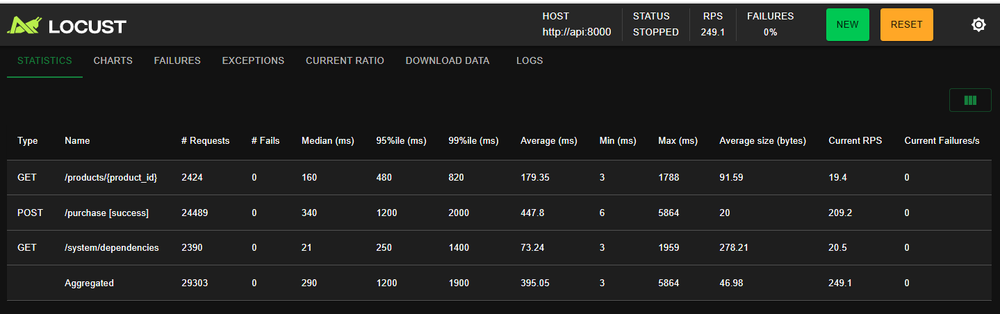
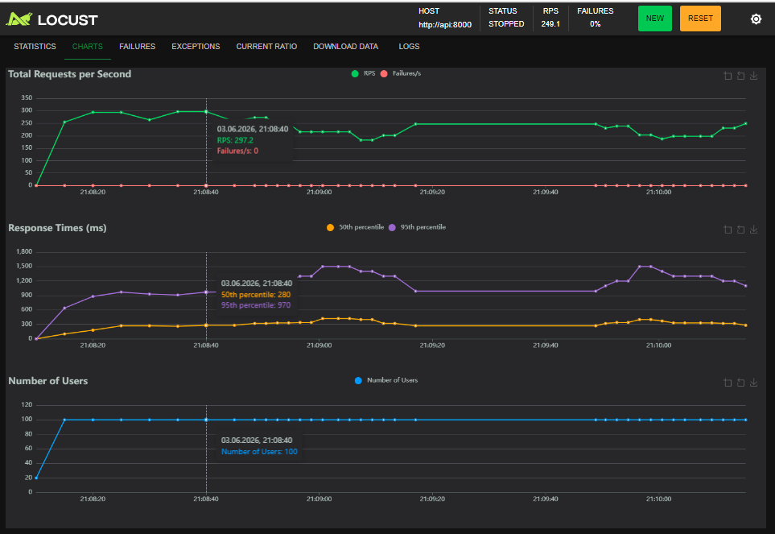

# FastAPI High-Load Shop Backend


## English

Production-style educational backend for testing concurrent purchases under load. The API keeps product stock correct with an atomic PostgreSQL update, stores lightweight counters in Redis, publishes purchase events to RabbitMQ, and is exposed through Nginx.

## Services

| Service | Purpose | URL |
| --- | --- | --- |
| Frontend | Manual purchase and browser RPS test | http://127.0.0.1:8000/frontend/ |
| FastAPI docs | API documentation | http://127.0.0.1:8000/docs |
| Healthcheck | API status | http://127.0.0.1:8000/health |
| Dependencies | Redis/RabbitMQ status | http://127.0.0.1:8000/system/dependencies |
| Locust | Load-test UI | http://127.0.0.1:8089 |
| Redis Commander | Redis browser UI | http://127.0.0.1:8081 |
| RabbitMQ UI | RabbitMQ management | http://127.0.0.1:15672 |

RabbitMQ login:

```text
guest / guest
```

## First Run

The repository does not commit `.env`. The local `.env` is created from `.env.example`.

Windows PowerShell:

```powershell
git clone <your-repository-url>
cd fastapi_backend_store_6
powershell -ExecutionPolicy Bypass -File scripts\start.ps1
```

Linux/macOS:

```bash
git clone <your-repository-url>
cd fastapi_backend_store_6
sh scripts/start.sh
```

Manual equivalent:

```powershell
Copy-Item .env.example .env
docker compose up -d --build
docker compose ps
```

## Environment Files

`.env.example` is the public template with demo values. `.env` is the local runtime file used by Docker Compose and ignored by Git.

Do not put real production secrets into `.env.example`.

## Useful Commands

```powershell
# Start or rebuild everything
docker compose up -d --build

# Show containers
docker compose ps

# Logs
docker compose logs --tail=80 api nginx locust

# API checks
Invoke-RestMethod http://127.0.0.1:8000/health
Invoke-RestMethod http://127.0.0.1:8000/system/dependencies

# Reset product stock before tests
$body = @{ stock = 50000 } | ConvertTo-Json
Invoke-RestMethod -Uri "http://127.0.0.1:8000/products/42/reset" -Method Post -ContentType "application/json" -Body $body

# Browser-independent Python load test
python tests\load_test.py --base-url http://127.0.0.1:8000 --rps 300 --duration 15 --concurrency 50 --timeout 5

# One-off Locust headless test
docker compose run --rm -T --no-deps locust -f /mnt/locust/locustfile.py --host http://api:8000 --headless -u 100 -r 20 -t 30s --stop-timeout 5

# Sanity tests
python -m pytest
```

## Locust Reset

Locust can look “stuck” on the second UI run if the browser keeps an old chart session or if product stock is already depleted. This project resets the test product automatically at the start of each Locust run:

```text
LOCUST_PRODUCT_ID=42
LOCUST_RESET_STOCK=50000
```

Change these values in `.env`. Set `LOCUST_RESET_STOCK=0` only if you intentionally want to keep the current stock.

Reset only Locust:

```powershell
docker compose restart locust
```

Full Locust UI reset:

```powershell
docker compose stop locust
docker compose rm -f locust
docker compose up -d locust
```

In the browser, also try:

```text
Ctrl + F5
```

## CI / Sanity Workflow

`.github/workflows/sanity.yml` is a GitHub Actions workflow. It runs on GitHub after push or pull request and checks that dependencies install and `pytest` passes.

The CI badge was removed from the top of this README because a badge URL is repository-specific. A broken badge usually means one of these:

- the workflow file has not been pushed to GitHub yet;
- GitHub Actions is disabled for the repository;
- the README badge URL uses the wrong owner or repository name;
- the workflow has never run.

If you want the badge back after pushing to GitHub, use this format and replace owner/repository/branch:

```markdown

```

## Screenshots

Frontend RPS test:


Locust statistics:



Locust charts:



RabbitMQ overview:


---

## Українська

Це навчально-production приклад backend-магазину на FastAPI. Проєкт показує, як API поводиться під навантаженням, коли багато користувачів одночасно купують один товар.

Головна ідея: товар не можна продати “в мінус”. Для цього покупка виконується атомарним SQL-запитом у PostgreSQL:

```sql
UPDATE products
SET stock = stock - $1
WHERE product_id = $2
  AND stock >= $1
RETURNING product_id;
```

Перевірка залишку і списання відбуваються як одна операція. Якщо товару вистачає, PostgreSQL списує `stock`. Якщо товару не вистачає, API повертає `409 Conflict`, а склад не змінюється.

## Що є в проєкті

| Частина | Для чого потрібна |
| --- | --- |
| FastAPI | Основний HTTP API |
| PostgreSQL | Зберігає товар і залишок |
| Redis | Зберігає лічильник успішних покупок і останню покупку |
| RabbitMQ | Приймає події покупок у queue `purchase_events` |
| Nginx | Reverse proxy перед FastAPI |
| Frontend | Ручна покупка, reset stock, браузерний RPS-тест |
| Locust | Нормальніший load-test, ніж браузер |
| Redis Commander | Перегляд Redis через браузер |
| RabbitMQ UI | Перегляд черг RabbitMQ |
| GitHub Actions | Sanity test після push/pull request |

## Правильний перший запуск

У GitHub не треба зберігати `.env`, бо це локальний файл налаштувань. У репозиторії зберігається тільки `.env.example`.

Після завантаження проєкту запусти:

```powershell
powershell -ExecutionPolicy Bypass -File scripts\start.ps1
```

Цей скрипт:

1. Перевіряє, чи існує `.env`.
2. Якщо `.env` немає, копіює `.env.example` у `.env`.
3. Запускає `docker compose up -d --build`.
4. Показує `docker compose ps`.

Якщо хочеш зробити це вручну:

```powershell
Copy-Item .env.example .env
docker compose up -d --build
docker compose ps
```

Linux/macOS:

```bash
sh scripts/start.sh
```

## Навіщо `.env.example` і `.env`

`.env.example` - це шаблон для GitHub. У ньому можна показати demo-значення: користувач PostgreSQL, пароль для локального стенду, URL Redis, URL RabbitMQ, налаштування Locust.

`.env` - це реальний локальний файл, який читає Docker Compose. Він створюється з `.env.example`, але не комітиться в Git.

Така схема нормальна для production-проєктів: приклад налаштувань є в репозиторії, а реальні секрети або локальні значення залишаються тільки на машині розробника чи на сервері.

## Адреси після запуску

| Сервіс | URL |
| --- | --- |
| Frontend | http://127.0.0.1:8000/frontend/ |
| Swagger | http://127.0.0.1:8000/docs |
| Healthcheck | http://127.0.0.1:8000/health |
| Dependencies | http://127.0.0.1:8000/system/dependencies |
| Locust | http://127.0.0.1:8089 |
| Redis Commander | http://127.0.0.1:8081 |
| RabbitMQ UI | http://127.0.0.1:15672 |

RabbitMQ:

```text
guest / guest
```

## Команди для перевірки

```powershell
docker compose ps
docker compose logs --tail=80 api nginx locust
Invoke-RestMethod http://127.0.0.1:8000/health
Invoke-RestMethod http://127.0.0.1:8000/system/dependencies
```

Скинути залишок товару:

```powershell
$body = @{ stock = 50000 } | ConvertTo-Json
Invoke-RestMethod -Uri "http://127.0.0.1:8000/products/42/reset" -Method Post -ContentType "application/json" -Body $body
```

Запустити Python load test:

```powershell
python tests\load_test.py --base-url http://127.0.0.1:8000 --rps 300 --duration 15 --concurrency 50 --timeout 5
```

Запустити Locust без UI:

```powershell
docker compose run --rm -T --no-deps locust -f /mnt/locust/locustfile.py --host http://api:8000 --headless -u 100 -r 20 -t 30s --stop-timeout 5
```

## Frontend

Frontend потрібен для ручної перевірки:

- купити товар через `POST /purchase`;
- оновити поточний залишок;
- скинути `stock`;
- запустити браузерний RPS-тест;
- побачити `successful`, `409 Conflict`, `Dropped`, `Actual RPS`.


`Dropped` не завжди означає помилку backend. Часто це означає, що браузер не встигає створити запланований RPS. Для точнішого benchmark краще використовувати Locust або `tests/load_test.py`.

## Locust

Locust краще підходить для RPS-тесту, ніж браузерний frontend-тест. Він показує таблиці, RPS, latency percentiles і charts.


## Чому другий запуск Locust іноді не малює charts

Є дві часті причини:

1. Locust UI або браузер тримає стару live-сесію charts.
2. Після першого тесту stock уже закінчився, другий тест швидко отримує `409 Conflict`, зупиняється, і графік майже не встигає намалюватися.

У цьому проєкті друга причина виправлена: Locust перед кожним запуском скидає тестовий товар:

```text
LOCUST_PRODUCT_ID=42
LOCUST_RESET_STOCK=50000
```

Це налаштовується в `.env`.

Якщо charts все одно не оновлюються:

```powershell
docker compose restart locust
```

Або повністю пересоздай тільки Locust:

```powershell
docker compose stop locust
docker compose rm -f locust
docker compose up -d locust
```

У браузері також натисни:

```text
Ctrl + F5
```

## RabbitMQ

RabbitMQ працює як черга подій. Кожна успішна покупка створює повідомлення в `purchase_events`.


Якщо в RabbitMQ багато `Ready` messages, це означає, що API створює події, але окремого consumer-сервісу ще немає. Для навчального стенду це нормально. Для production наступний крок - додати worker, який читає queue.

Корисні команди:

```powershell
docker compose exec rabbitmq rabbitmqctl list_queues name messages_ready messages_unacknowledged consumers
docker compose exec rabbitmq rabbitmqctl purge_queue purchase_events
```

## Sanity Test і файл `.github/workflows/sanity.yml`

Sanity test - це швидка перевірка, що структура проєкту не зламана:

- важливі файли існують;
- `.env` не лежить у Git;
- Python-файли парсяться без синтаксичних помилок;
- у `app/` немає `__pycache__`.

Локально:

```powershell
python -m pytest
```

У GitHub це запускає файл:

```text
.github/workflows/sanity.yml
```

Чому badge зверху не показувався: CI badge не є файлом, який “скачується” в проєкт. Це SVG, який GitHub генерує за URL конкретного репозиторію. Якщо URL неправильний, workflow ще не запушений або GitHub Actions ще не запускались, картинка буде битою. Тому я прибрав CI badge з верхньої частини README, щоб GitHub не виглядав неохайно.

Коли репозиторій буде на GitHub і Actions запустяться, можна повернути badge так:

```markdown

```

## `__pycache__`

`__pycache__` - це службові файли Python. Вони створюються автоматично для пришвидшення імпортів. Це не код і не документація, тому в GitHub їх не потрібно зберігати.

Видалити локально:

```powershell
$root = (Resolve-Path .).Path
foreach ($dir in @('app\__pycache__','tests\__pycache__')) {
  $full = (Resolve-Path $dir -ErrorAction SilentlyContinue).Path
  if ($full -and $full.StartsWith($root)) {
    Remove-Item -LiteralPath $full -Recurse -Force
  }
}
```

`.gitignore` уже містить:

```text
__pycache__/
*.py[cod]
.pytest_cache/
```

## Production Notes

- `.env.example` залишається в Git як шаблон.
- `.env` створюється локально і не комітиться.
- `docker-compose.yml` читає `.env` через `env_file`.
- Locust автоматично готує stock перед тестом.
- RabbitMQ може накопичувати повідомлення, якщо немає consumer.
- Для точного benchmark краще використовувати Locust headless або Python load test, а не браузерний RPS-тест.
