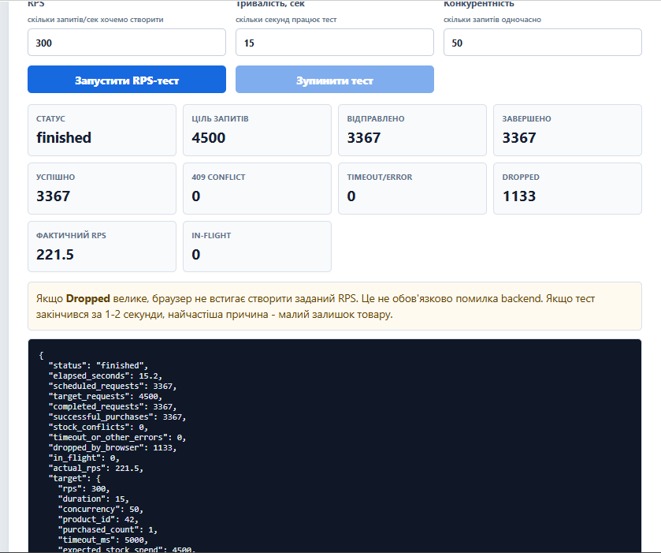
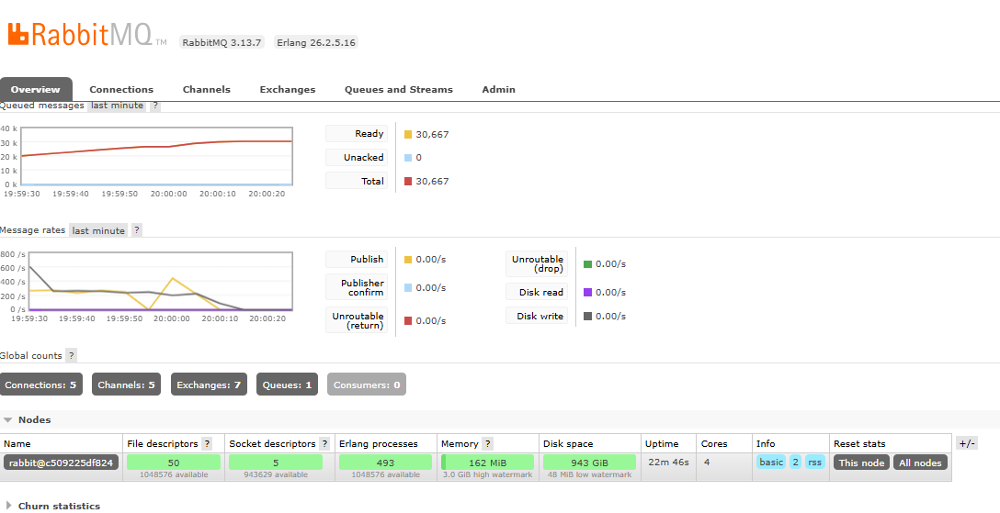

# FastAPI High-Load Shop Backend


## English

Production-style FastAPI backend for testing concurrent purchases under load. The API keeps product stock correct with an atomic PostgreSQL update, records purchase counters in Redis, publishes purchase events to RabbitMQ, and exposes the system through Nginx.

## Stack

| Service | Purpose | URL |
| --- | --- | --- |
| Frontend | Manual purchase and browser RPS test | http://127.0.0.1:8000/frontend/ |
| FastAPI docs | API documentation | http://127.0.0.1:8000/docs |
| Healthcheck | API health | http://127.0.0.1:8000/health |
| Dependencies | Redis/RabbitMQ status | http://127.0.0.1:8000/system/dependencies |
| Locust | Load-test UI | http://127.0.0.1:8089 |
| Redis Commander | Redis keys | http://127.0.0.1:8081 |
| RabbitMQ UI | RabbitMQ queues | http://127.0.0.1:15672 |

RabbitMQ login:

```text
guest / guest
```

## Run

The project works without a committed `.env`. Defaults are defined in `docker-compose.yml` and `app/config.py`.

```powershell
docker compose up -d --build
docker compose ps
```

Optional local overrides:

```powershell
Copy-Item .env.example .env
```

`.env` is ignored by Git. Keep `.env.example` as the public template.

## Common Commands

```powershell
# Logs
docker compose logs --tail=80 api nginx locust

# Restart API after code changes
docker compose up -d --build api nginx

# Reset product stock before load tests
$body = @{ stock = 50000 } | ConvertTo-Json
Invoke-RestMethod -Uri "http://127.0.0.1:8000/products/42/reset" -Method Post -ContentType "application/json" -Body $body

# Run local Python load test
python tests\load_test.py --base-url http://127.0.0.1:8000 --rps 300 --duration 15 --concurrency 50 --timeout 5

# Run one-off Locust headless test
docker compose run --rm -T --no-deps locust -f /mnt/locust/locustfile.py --host http://api:8000 --headless -u 100 -r 20 -t 30s --stop-timeout 5

# Run sanity tests
python -m pytest
```

## Reset Locust

By default Locust resets `product_id=42` to `50000` stock at the start of every Locust run. This is controlled by:

```text
LOCUST_PRODUCT_ID=42
LOCUST_RESET_STOCK=50000
```

Set `LOCUST_RESET_STOCK=0` if you want Locust to keep the current database stock.

If Locust statistics work but charts do not update on the second run, first click the orange `RESET` button in the Locust UI. If the chart is still stale, restart only the Locust service:

```powershell
docker compose restart locust
```

Then open:

```text
http://127.0.0.1:8089
```

If the browser still shows stale charts:

```text
Ctrl + F5
```

Full Locust container reset:

```powershell
docker compose stop locust
docker compose rm -f locust
docker compose up -d locust
```

Why it happens: Locust keeps in-memory test statistics and the browser keeps a live UI/WebSocket session. A second run may show statistics while the chart canvas does not redraw cleanly. Another common reason is depleted product stock: the test gets `409 Conflict` immediately and stops before charts have enough data. Restarting only the `locust` service resets Locust without touching PostgreSQL, Redis, RabbitMQ, or API data.

## Cleanup

`__pycache__` directories are Python bytecode cache. They are not source code and should not be committed.

```powershell
$root = (Resolve-Path .).Path
foreach ($dir in @('app\__pycache__','tests\__pycache__')) {
  $full = (Resolve-Path $dir -ErrorAction SilentlyContinue).Path
  if ($full -and $full.StartsWith($root)) {
    Remove-Item -LiteralPath $full -Recurse -Force
  }
}
```

## CI

The badge at the top is a GitHub Actions status badge. The workflow lives in:

```text
.github/workflows/sanity.yml
```

It installs dependencies and runs:

```powershell
pytest
```

## Screenshots





---

## Українська

Це навчально-production приклад backend-магазину на FastAPI. Проєкт показує, як API поводиться під навантаженням, коли багато користувачів одночасно купують один товар.

Головна backend-проблема тут проста: товар не можна продати “в мінус”. Для цього покупка виконується через атомарний SQL-запит у PostgreSQL:

```sql
UPDATE products
SET stock = stock - $1
WHERE product_id = $2
  AND stock >= $1
RETURNING product_id;
```

Якщо товар є, PostgreSQL списує `stock`. Якщо товару не вистачає, API повертає `409 Conflict`, а залишок не змінюється.

## Що є в проєкті

| Частина | Для чого потрібна |
| --- | --- |
| FastAPI | Основний HTTP API |
| PostgreSQL | Зберігає товар і залишок |
| Redis | Зберігає лічильник успішних покупок і останню покупку |
| RabbitMQ | Приймає події покупок у queue `purchase_events` |
| Nginx | Reverse proxy перед FastAPI |
| Frontend | Ручна покупка, reset stock, браузерний RPS-тест |
| Locust | Нормальніший load-test, ніж браузер |
| Redis Commander | Перегляд Redis через браузер |
| RabbitMQ UI | Перегляд черг RabbitMQ |
| GitHub Actions | Sanity test у GitHub після push/pull request |

## Як запустити

```powershell
docker compose up -d --build
docker compose ps
```

Якщо треба змінити worker-и, pool або паролі локально:

```powershell
Copy-Item .env.example .env
```

Після цього редагуй `.env`. Сам файл `.env` ігнорується Git-ом.

## Адреси

| Сервіс | URL |
| --- | --- |
| Frontend | http://127.0.0.1:8000/frontend/ |
| Swagger | http://127.0.0.1:8000/docs |
| Healthcheck | http://127.0.0.1:8000/health |
| Dependencies | http://127.0.0.1:8000/system/dependencies |
| Locust | http://127.0.0.1:8089 |
| Redis Commander | http://127.0.0.1:8081 |
| RabbitMQ UI | http://127.0.0.1:15672 |

RabbitMQ:

```text
guest / guest
```

## Frontend

Frontend потрібен для ручної перевірки:

- купити товар через `POST /purchase`;
- оновити поточний залишок;
- скинути `stock`;
- запустити браузерний RPS-тест;
- побачити `successful`, `409 Conflict`, `Dropped`, `Actual RPS`.

На скриншоті видно тест `300 RPS`, `15 sec`, `concurrency 50`. Браузер завершив `3367` запитів із `4500`, а `1133` були `Dropped`.


`Dropped` не завжди означає помилку backend. Часто це означає, що браузер не встигає створити запланований RPS. Для точнішого benchmark краще використовувати Locust або `tests/load_test.py`.

## Locust: чому другий запуск може не показувати charts

Locust UI тримає статистику в памʼяті контейнера і окремо малює charts у браузері. Іноді після першого тесту другий запуск оновлює таблиці, але графіки не перемальовуються. Це не проблема RabbitMQ або API. Найчастіше це стан Locust UI, браузерної сесії або закінчений stock.

У цьому проєкті Locust перед кожним запуском автоматично скидає тестовий товар:

```text
LOCUST_PRODUCT_ID=42
LOCUST_RESET_STOCK=50000
```

Це зроблено спеціально, щоб другий запуск Locust не завершувався миттєво через `409 Conflict`. Якщо хочеш тестувати поведінку з малим залишком, постав у `.env`:

```text
LOCUST_RESET_STOCK=0
```

Швидкий reset:

```powershell
docker compose restart locust
```

Після цього відкрий:

```text
http://127.0.0.1:8089
```

Якщо браузер показує старий стан:

```text
Ctrl + F5
```

Повний reset тільки Locust:

```powershell
docker compose stop locust
docker compose rm -f locust
docker compose up -d locust
```

Це не видаляє PostgreSQL, Redis або RabbitMQ volumes. Воно перезапускає тільки load-test UI.

Headless запуск через термінал:

```powershell
docker compose run --rm -T --no-deps locust -f /mnt/locust/locustfile.py --host http://api:8000 --headless -u 100 -r 20 -t 30s --stop-timeout 5
```

Пояснення:

- `--no-deps` не створює заново API/Postgres/Redis/RabbitMQ, якщо вони вже запущені;
- `--headless` запускає тест без UI;
- `-u 100` створює 100 користувачів;
- `-r 20` додає 20 користувачів за секунду;
- `-t 30s` обмежує тест 30 секундами;
- `--stop-timeout 5` дає Locust 5 секунд на акуратне завершення.

## RabbitMQ

RabbitMQ працює як черга подій. Кожна успішна покупка створює повідомлення в `purchase_events`.


На скриншоті видно, що в RabbitMQ є `30,667` повідомлень `Ready`. Це означає: API створює події, але окремого consumer-сервісу поки немає, тому повідомлення накопичуються. Для навчального прикладу це нормально. У production наступний крок - додати worker, який читає цю чергу.

Корисні команди:

```powershell
docker compose exec rabbitmq rabbitmqctl list_queues name messages_ready messages_unacknowledged consumers
docker compose exec rabbitmq rabbitmqctl purge_queue purchase_events
```

## Load Test Через Python

```powershell
python tests\load_test.py --base-url http://127.0.0.1:8000 --rps 300 --duration 15 --concurrency 50 --timeout 5
```

У summary тепер є блок `Concurrency math`. Він пояснює, чому цільовий RPS може бути більшим за фактичний.

Формула:

```text
max RPS приблизно = concurrency / latency_seconds
```

Наприклад, якщо `concurrency=50`, а середня latency `0.55s`, то фізична межа приблизно:

```text
50 / 0.55 = 90 RPS
```

Тому `--rps 500` означає тільки ціль тестера, а не гарантію, що backend реально видасть 500 RPS.

## Sanity Test

Sanity test - це швидка перевірка, що важливі файли проєкту існують і структура не зламана.

Запуск локально:

```powershell
python -m pytest
```

У GitHub це запускається автоматично через `.github/workflows/sanity.yml`. Саме цей workflow дає CI badge зверху README.

## `__pycache__`

`__pycache__` - це службові файли Python, які створюються автоматично для пришвидшення імпортів. Вони не потрібні в GitHub і не є частиною коду.

Видалити локально:

```powershell
$root = (Resolve-Path .).Path
foreach ($dir in @('app\__pycache__','tests\__pycache__')) {
  $full = (Resolve-Path $dir -ErrorAction SilentlyContinue).Path
  if ($full -and $full.StartsWith($root)) {
    Remove-Item -LiteralPath $full -Recurse -Force
  }
}
```

`.gitignore` уже містить:

```text
__pycache__/
*.py[cod]
```

## Production Notes

- `.env` не комітиться.
- `.env.example` лишається як шаблон.
- `docker-compose.yml` має дефолти, тому проєкт стартує без `.env`.
- Locust reset робиться окремо, без reset бази.
- RabbitMQ може накопичувати повідомлення, якщо немає consumer.
- Для точного benchmark краще використовувати Locust headless або Python load test, а не браузерний RPS-тест.
